# Multi Restaurants Flutter + PHP Laravel Admin Panel
Multi Restaurants App it's complete project using Flutter as mobile app for clients and PHP Laravel admin panel for restaurants manager and admin.
you can reuse more than 60 widgets to customize your application.

_NB: The same code used for both iOS and Android_

## PHP Laravel Admin Panel
Laravel is a web application framework with expressive, elegant syntax. We’ve already laid the foundation freeing you to create without sweating the small things.

The Laravel framework has a few system requirements. Of course, all of these requirements are satisfied by the Laravel Homestead virtual machine, so it's highly recommended that you use Homestead as your local Laravel development environment.

However, if you are not using Homestead, you will need to make sure your server meets the following requirements:

- PHP >= 7.2.0
- OpenSSL PHP Extension
- PDO PHP Extension
- Mbstring PHP Extension
- Tokenizer PHP Extension
- XML PHP Extension
- Ctype PHP Extension
- JSON PHP Extension
- proc_open Extension

### Installation

After you download (_and rate our app on Codecanyon_ [Using this link](https://codecanyon.net/downloads)).

1 - You should find the folder named `/Multi Restaurants Laravel App` zip it and upload it inside your `/public_html` in your hosting (we use Bluehost hosting [Create Your Own](https://www.bluehost.com/track/smartervision/)).

[](https://www.bluehost.com/track/smartervision/)

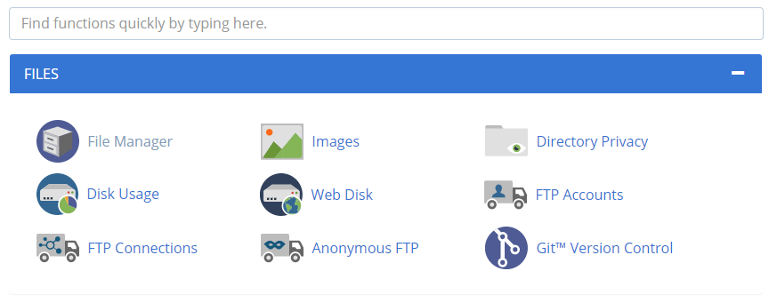

2 - Extract it you should get the following files in your file manager

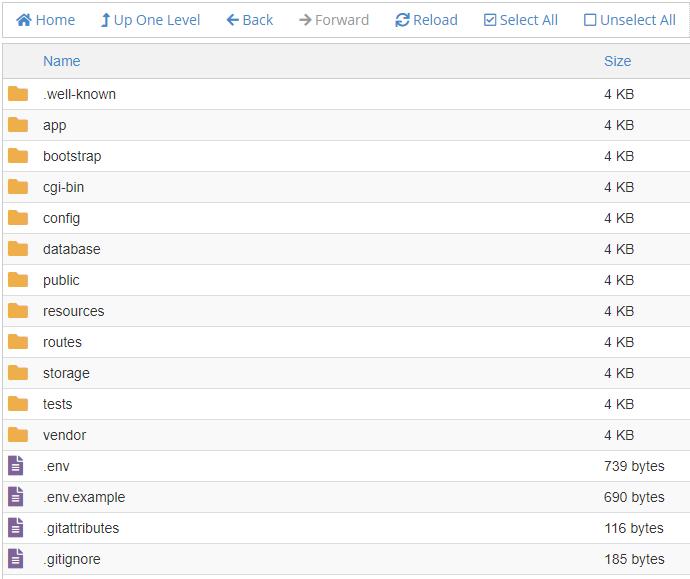

3 - Go to `MySQL Database` to Create new database for example `multi_restaurants` and new user and assign this database to the user created (remember the password used in this step we will use it in installation step.

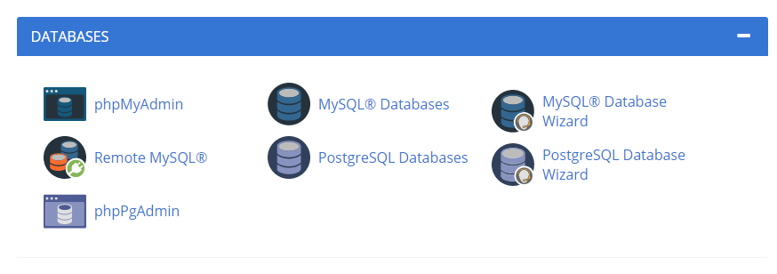

4 - Open `http://yourdomain.com/public/install`.

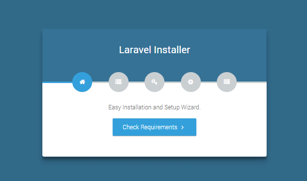

5 - Click check requirements after that:

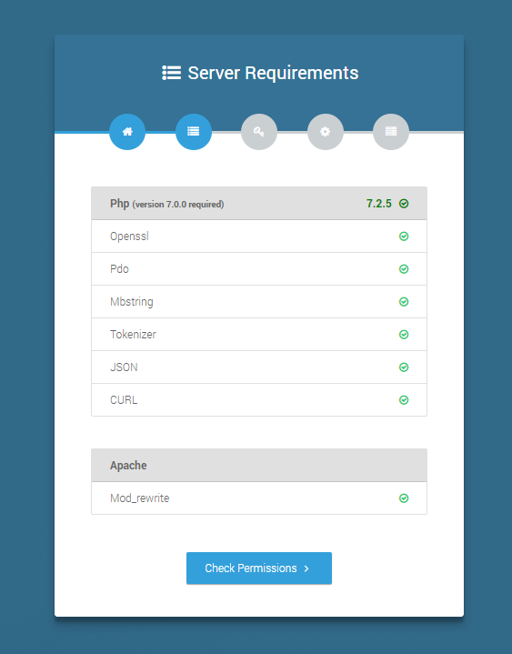

6 - Fill the form with your application details:

You can find your purchase code here [Using this link](https://codecanyon.net/downloads)

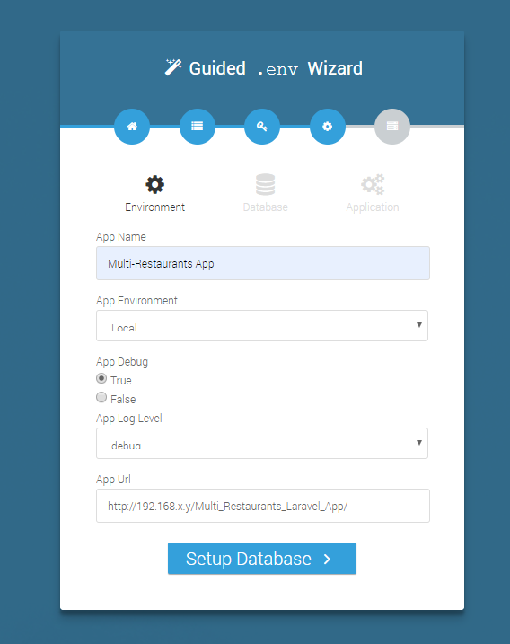

7 - Use same credentials created in [bluehost](https://www.bluehost.com/track/smartervision/):

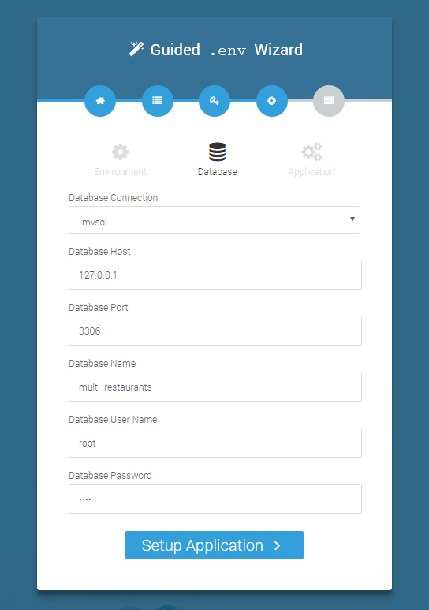

8 - You should get it if you have any other error please go to `public_html/storage` and delete the `installed` file and remove your database created in step 3 after that repeat the instructions be carefully.

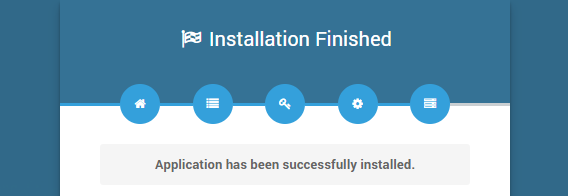

## Client & Driver Mobile App
Mobile app developed using flutter framework created by Google is an open-source mobile application development. It is used to develop applications for Android and iOS, as well as being the primary method of creating applications

### Installation
- To edit this project you must have Flutter and Dart installed and configured successfully on your device
[Install flutter](https://flutter.dev/docs/get-started/install)

- Set up your editor
[Install the Flutter and Dart plugins](https://flutter.dev/docs/get-started/editor?tab=androidstudio)

#### Common
1- Download and unzip the `Multi Restaurants Flutter App`, use your preferred IDE (**Android Studio / Visual Code / IntelliJ**) to open the project.

2- Go to `/assets/img/logo.png` and replace it with your logo or app icon (its used in the splash screen not in the app icon)

Get Google Maps API key at <https://cloud.google.com/maps-platform/>.

#### Android

1- Create your app icon `ic_launcher` and notification icon `ic_notification` folders [How to generate app icon?](https://romannurik.github.io/AndroidAssetStudio/icons-launcher.html) after you generate icons folder replace the following folders:
- `/mipmap-hdpi` in `/android/app/src/main/res/` folder
- `/mipmap-mdpi` in `/android/app/src/main/res/` folder
- `/mipmap-xhdpi` in `/android/app/src/main/res/` folder
- `/mipmap-xxhdpi` in `/android/app/src/main/res/` folder
- `/mipmap-xxxhdpi` in `/android/app/src/main/res/` folder

NB: must rename app icon `ic_launcher` and notification icon `ic_notification`

2- And just run the following command
```
flutter pub get
```
If you want to change the package name following files and folders

3- Rename `food_delivery_app.iml` and `android/food_delivery_app_android.iml` (just replace food_delivery_app by you app name)

4- Open `/android/app/build.gradle` and change the package name
```json
    defaultConfig {
        applicationId "<REPLACE WITH YOUR PACKAGE NAME>" // this is the package name
        minSdkVersion 20
        targetSdkVersion 28
        versionCode flutterVersionCode.toInteger()
        versionName flutterVersionName
        testInstrumentationRunner "android.support.test.runner.AndroidJUnitRunner"
    }
```

5- Open `/android/app/src/main/AndroidManifest.xml` , `/android/app/src/profil/AndroidManifest.xml`, `/android/app/src/debug/AndroidManifest.xml` and specify your _YOUR PACKAGE NAME_ , _YOUR APPLICATION NAME_, _YOUR GOOGLE MAPS KEY_

_NB: You can get Google Maps API key at <https://cloud.google.com/maps-platform/>._

```xml
<manifest xmlns:android="http://schemas.android.com/apk/res/android"
    package="<YOUR PACKAGE NAME>">

    <uses-permission android:name="android.permission.INTERNET"/>
    <uses-permission android:name="android.permission.ACCESS_FINE_LOCATION"/>
    <uses-permission android:name="android.permission.ACCESS_COARSE_LOCATION"/>

    <!-- io.flutter.app.FlutterApplication is an android.app.Application that
         calls FlutterMain.startInitialization(this); in its onCreate method.
         In most cases you can leave this as-is, but you if you want to provide
         additional functionality it is fine to subclass or reimplement
         FlutterApplication and put your custom class here. -->
    <application
        android:name=".Application"
        android:label="<YOUR APPLICATION NAME>"
        android:icon="@mipmap/ic_launcher">

        <meta-data android:name="com.google.android.geo.API_KEY"
                   android:value="<YOUR GOOGLE MAPS KEY>"/>
```

6- Open `/android/app/src/main/kotlin/<Your Package name folders>/Application.kt` and change the package name same thing with `/android/app/src/main/kotlin/<Your Package name folders>/MainActivity.kt`

7- In your `pubspec.yaml` in the top of this file, change the name with your app name and the project description.

8- In your project opened in your editor select root folder then right click and choose (Replace in Path) to replace all `package:markets/` by your package name

9- Copy the generated `google-service.json` file in `/android/app/` folder, you can see this video tutorial [How to configure push notifications](https://www.youtube.com/watch?v=T0tFfHrL4iM)

#### iOS

Specify your API key in the application delegate `ios/Runner/AppDelegate.m`:

```objectivec
#include "AppDelegate.h"
#include "GeneratedPluginRegistrant.h"
#import "GoogleMaps/GoogleMaps.h"

@implementation AppDelegate

- (BOOL)application:(UIApplication *)application
    didFinishLaunchingWithOptions:(NSDictionary *)launchOptions {
  [GMSServices provideAPIKey:@"YOUR KEY HERE"];
  [GeneratedPluginRegistrant registerWithRegistry:self];
  return [super application:application didFinishLaunchingWithOptions:launchOptions];
}
@end
```

Or in your swift code, specify your API key in the application delegate `ios/Runner/AppDelegate.swift`:

```swift
import UIKit
import Flutter
import GoogleMaps

@UIApplicationMain
@objc class AppDelegate: FlutterAppDelegate {
  override func application(
    _ application: UIApplication,
    didFinishLaunchingWithOptions launchOptions: [UIApplicationLaunchOptionsKey: Any]?
  ) -> Bool {
    GMSServices.provideAPIKey("YOUR KEY HERE")
    GeneratedPluginRegistrant.register(with: self)
    return super.application(application, didFinishLaunchingWithOptions: launchOptions)
  }
}
```
Opt-in to the embedded views preview by adding a boolean property to the app's `Info.plist` file
with the key `io.flutter.embedded_views_preview` and the value `YES`.

- Click the Get dependencies or Packages get to install the libraries from `pubspecs.yaml` file.

- Open the simulator to run iOS or Android (as the step above)

- Then press the run button to start project (you can still open multi simulator at the same time)

### Configuration

- Open `/assets/cfg/configurations.json` and edit the remote link example if you use local host as described in the admin panel

```json
{
  "api_base_url": "http://yourdomain.com/public/api/",
  "base_url": "http://yourdomain.com/public/"
}
```
### Run the app

In the target selector, select an Android device for running the app. If none are listed as available, select Tools> Android > AVD Manager and create one there. For details, see [Managing AVDs](https://developer.android.com/studio/run/managing-avds).

Click the run icon in the toolbar, or invoke the menu item Run > Run.
Locate the main Android Studio toolbar:


### Build and Install App
1- Generate Key by running the following command:
```
keytool -genkey -v -keystore key.jks -keyalg RSA -keysize 2048 -validity 10000 -alias key
```
   
2- Open `/android/key.properties` and edit the following attributes:
```
storePassword=<Your Key Password>
keyPassword=<Your Key Password>
keyAlias=key
storeFile=<Your Absolute Path to key.jks generated in step 1>
```
3- After you making all you changes and customizations save the project, Open the console, navigate to you project folder
 - Run `flutter build apk --release` you should get the apk file in the `/output` folder
 - Run `flutter install` to install you application on your connected devises

### Files Structure
The flutter App `Multi_Restaurants_Flutter_App` use MVC Pattern.
- Models
In this folder `Multi_Restaurants_Flutter_App/lib/src/models` you should find all models and Entities used in the App just you can link them with your backend (**Firebase, PHP, JAVA, or other Api**) and you can you collection and list in your **App**


**Example:**
```dart
//...
class Food {
  String id;
  String name;
  String restaurantName;
  double price;
  String image;
  String description;
  String ingredients; 
  String weight;
  //...
```
- Controllers
`Multi_Restaurants_Flutter_App/lib/src` inside this folder you should find controllers of the app 
- Views
In this folder `Multi_Restaurants_Flutter_App/lib/src/elements` there are **+60 Widgets** ready to use in your **App**:


Just you can call the widget class and customize it with you parameters and you can get the stylish widget integrated in your app

**Example:**
```dart
//...
    new BlockButtonWidget(
      onPressed: () {
        Navigator.of(context).pushNamed('/Pages', arguments: 2);
      },
      color: Theme.of(context).accentColor,
      text: Text('Verify'.toUpperCase(),
          style: Theme.of(context).textTheme.title.merge(TextStyle(color: Theme.of(context).primaryColor))),
    ),
//...
```

In this folder `Multi_Restaurants_Flutter_App/lib/src/pages` there are **+20 Pages/Screens** pre-made:


Just you can edit or link your backend with this page to get awesome customized page

## Update
_NB: If you will install the project for the first time skip this step_

Download new version from Codecanyon [Here](https://codecanyon.net/downloads) and extract the files in the folder `/Update`.

### PHP Laravel Admin Panel

- Zip the content of this folder `Update/Multi Restaurants Laravel App`, upload it to your main folder in your hosting `/public_html` extract this zip file and overrate all files.

NB: You must find `<VERSION_CODE>` in [change log](https://codecanyon.net/item/multi-restaurants-flutter-php-laravel-admin-panel/24878940/#item-description__change-log) in our item description in Codecanyon


- Open `http://yourdomain.com/public/update/<VERSION_CODE>`, follow the steps

### Flutter Client Mobile Application

- Extract the files in the folder `/Update` and replace the folders and files.

- To update the dependencies open your console, go to your root folder of your project and run:
```
flutter pub get
```

_NB: We aren't responsible if you loose your customization or your data, please do those steps be carefully_

## Getting Started with Admin Panel
### Accounts information
After the installation you can login with 3 default roles

**ADMIN**

User or email: admin@demo.com | Password: 123456

**RESTAURANT MANAGER**

User or email: manager@demo.com | Password: 123456

**CLIENT**

User or email: client@demo.com | Password: 123456
### Settings
#### Global settings
You can edit the global settings you should find the link in the side bar named `Settings > Global Settings`

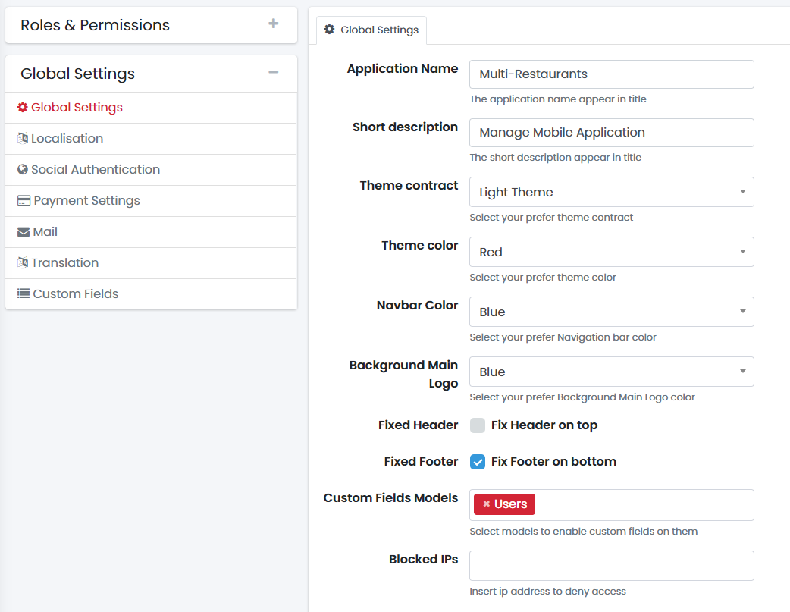
#### Localisation Settings
Manage localisation setting date, timezone, default app language

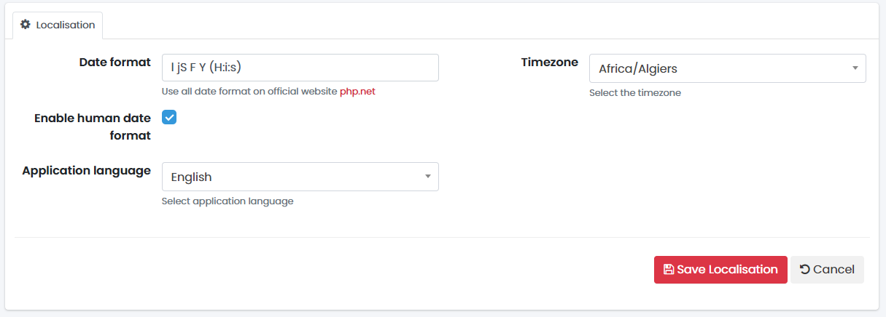
Date Format: Enter the Date format that correspond to your Country

We formatted the date with 'l jS F Y (H:i:s)' so it gives

- j – Day of the month without leading zeros ( 1 to 31 )
- M – A short textual representation of a month, three letters ( Jan through Dec )
- Y – A full numeric representation of a year, 4 digits ( Examples: 1999 or 2003 )
- H:i:s – Hours, minutes and seconds
- A – AM / PM
- e – Time zone ( default UTC )

#### Social Authentication
After you create an app for login with social media you can put all the information of the facebook app, google plus app or twitter app in this section
`Settings > Social Authentication`
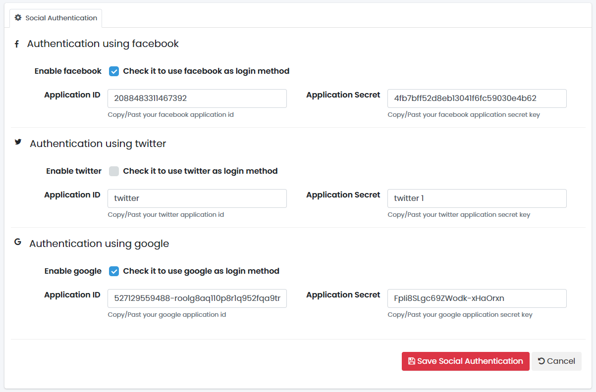

#### Payment Settings
You must create account on stripe payments gateway after that you can add the (Stripe Key and Stripe Secret)

Also you can edit the default tax percentage used in the app
`Settings > Payments Setting`
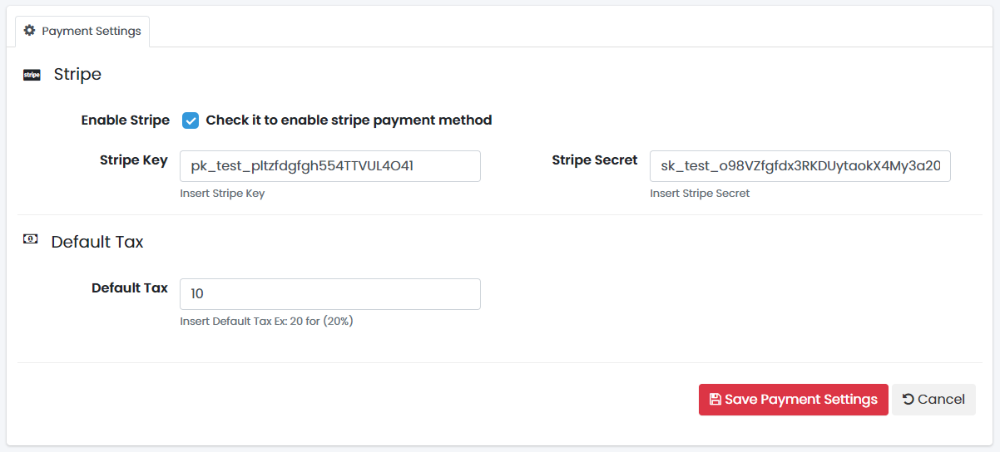

#### Email Settings
`Settings > Emails`
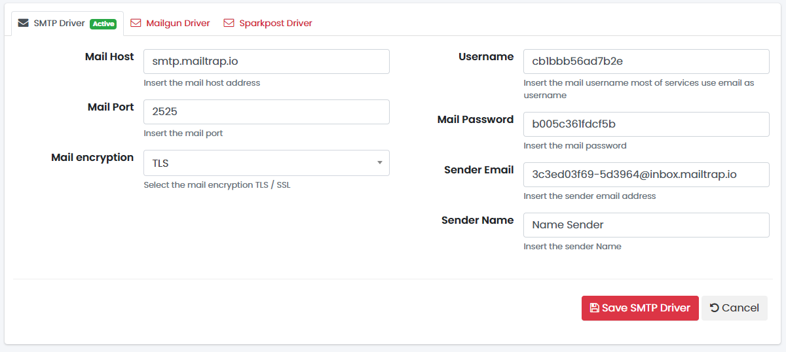

#### Translation
`Settings > Translation`
- To add new language to the admin panel, just duplicate `public_html/resources/lang/en` and rename it with your local language code for example `ar` for arabic then go to `https://yourdomain.com/public/settings/translation/en` and choose you language and translate it

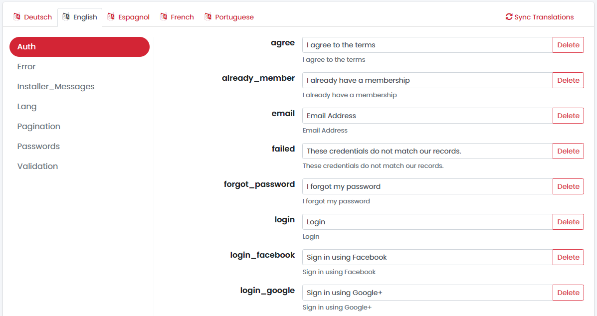

#### Custom Fields
You can add custom field and theirs types after that enable the custom field form `Settings > Global Settings`

`Settings > Custom Fields`
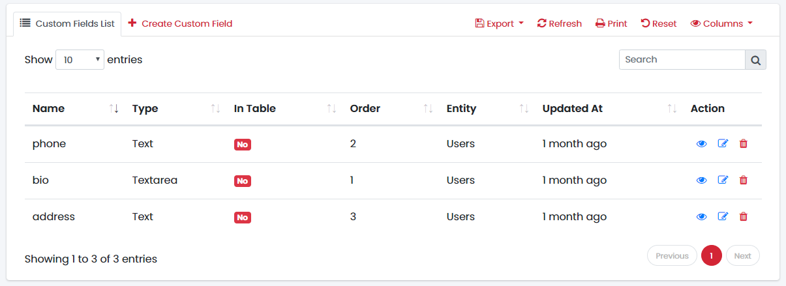

## Our Installation Service

[](https://www.bluehost.com/track/smartervision/)

- Send your PayPal account email to request payment
- cPanel credentials support with https enabled on your server, we prefer to use [Bluehost](https://www.bluehost.com/track/smartervision/) hosting
- Your logo (PNG format)
- Application name
- The main color (Ex: #FFCDD1)
- Gmail account credentials for enabling push notification.
- Google Maps Key
- Google Developers account if you need to upload the app on Google Play Store.
- Installation and configuration time is between 3 and 5 days after we receiving all information above


